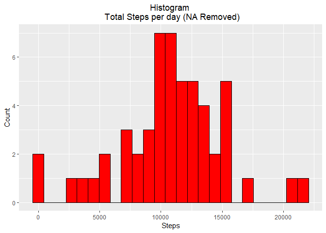
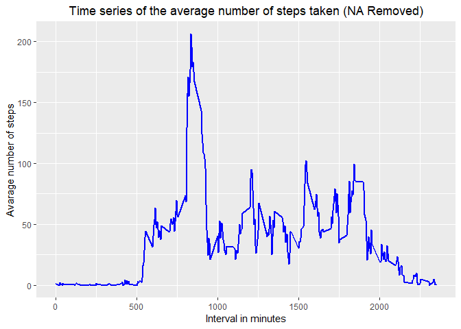
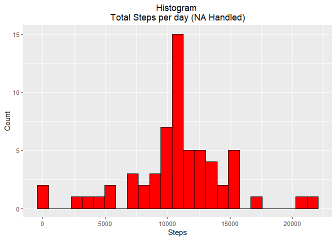
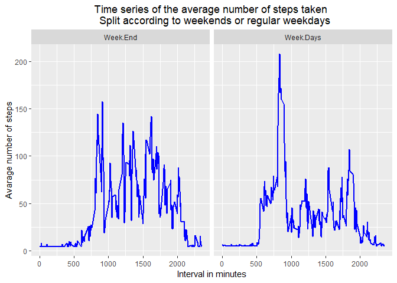

## Data Loading
Download the files and unzip them into a data directory. 
Check if data directory exists, if not create it.
Then download the data and unzip it if not already exist.
Read the Dataset into a data frame - Activity_DF.

```r
if(!file.exists("data")) {  
        dir.create("data")  
}  
if(!file.exists("./data/Activity.zip")) {  
        fileUrl <- "https://d396qusza40orc.cloudfront.net/repdata%2Fdata%2Factivity.zip"  
        download.file(fileUrl, destfile="./data/Activity.zip")  
        if(file.exists("./data/Activity.zip"))   
                unzip("./data/Activity.zip",exdir="./data")  
}
Activity_DF<-read.csv("./data/Activity.csv",sep = ",")
```


## First look at the dataset 
using str  Summary and head (ignoring the NA values in step) .
Getting first impression of the data.

```r
str(Activity_DF)
```

```
## 'data.frame':	17568 obs. of  3 variables:
##  $ steps   : int  NA NA NA NA NA NA NA NA NA NA ...
##  $ date    : Factor w/ 61 levels "2012-10-01","2012-10-02",..: 1 1 1 1 1 1 1 1 1 1 ...
##  $ interval: int  0 5 10 15 20 25 30 35 40 45 ...
```

```r
summary(Activity_DF)
```

```
##      steps                date          interval     
##  Min.   :  0.00   2012-10-01:  288   Min.   :   0.0  
##  1st Qu.:  0.00   2012-10-02:  288   1st Qu.: 588.8  
##  Median :  0.00   2012-10-03:  288   Median :1177.5  
##  Mean   : 37.38   2012-10-04:  288   Mean   :1177.5  
##  3rd Qu.: 12.00   2012-10-05:  288   3rd Qu.:1766.2  
##  Max.   :806.00   2012-10-06:  288   Max.   :2355.0  
##  NA's   :2304     (Other)   :15840
```

```r
#Use Head Show only the non missing values in steps 
head(Activity_DF[which(!is.na(Activity_DF$steps)), ])
```

```
##     steps       date interval
## 289     0 2012-10-02        0
## 290     0 2012-10-02        5
## 291     0 2012-10-02       10
## 292     0 2012-10-02       15
## 293     0 2012-10-02       20
## 294     0 2012-10-02       25
```


## What is mean total number of steps taken per day?


Group the number of steps by date and intervals. 
Find the total number of steps per day over all days. Some of the days have no steps data. 
This will be not shown in the plot.

```r
#Create a dataframe with  total steps per day  and dates
Steps_Per_Day<-data.frame(date = unique(as.Date(Activity_DF$date,"%Y-%m-%d")), Total.Steps = tapply(Activity_DF$steps,as.Date(Activity_DF$date,"%Y-%m-%d"),sum))

head(Steps_Per_Day)
```

```
##                  date Total.Steps
## 2012-10-01 2012-10-01          NA
## 2012-10-02 2012-10-02         126
## 2012-10-03 2012-10-03       11352
## 2012-10-04 2012-10-04       12116
## 2012-10-05 2012-10-05       13294
## 2012-10-06 2012-10-06       15420
```

Plot the Histogram of the total steps per day (without NA values).

```r
##Load ggplot2
library(ggplot2)

#Plot the Histogram (Remove missing values)
theme_update(plot.title = element_text(hjust = 0.5))
hist_NA_removed<-ggplot(data=na.omit(Steps_Per_Day),aes(Total.Steps))+geom_histogram(bins=10,colour='black', fill='red',binwidth = 900)+ggtitle("Histogram \n Total Steps per day (NA Removed)")+labs(x = "Steps",y = "Count")
hist_NA_removed
```

<!-- -->

Processing ...
Calculate the mean and median per day.

```r
#Add the mean and median steps per day to the Steps_Per_Day
Steps_Per_Day<-cbind(Steps_Per_Day,data.frame(Steps.mean = tapply(Activity_DF$steps,as.Date(Activity_DF$date,"%Y-%m-%d"),mean)))

Steps_Per_Day<-cbind(Steps_Per_Day,data.frame(Steps.median = tapply(Activity_DF$steps,as.Date(Activity_DF$date,"%Y-%m-%d"),median)))
head(Steps_Per_Day)
```

```
##                  date Total.Steps Steps.mean Steps.median
## 2012-10-01 2012-10-01          NA         NA           NA
## 2012-10-02 2012-10-02         126    0.43750            0
## 2012-10-03 2012-10-03       11352   39.41667            0
## 2012-10-04 2012-10-04       12116   42.06944            0
## 2012-10-05 2012-10-05       13294   46.15972            0
## 2012-10-06 2012-10-06       15420   53.54167            0
```

## What is the average daily activity pattern?

Calculate the average steps per interval.
This is done using the aggregate function 
Then print the interval with the maximum processing ...
Calculate the mean and median per day.

```r
#Calculate the averge steps per interval (NA Remove)
Steps_Per_Interval<-aggregate(Activity_DF$steps, 
                       by=list(Activity_DF$interval), 
                       FUN=mean, 
                       na.rm=TRUE)
#calculate The 5-minute interval that, on average, holds the maximum number of steps
sprintf("The 5-minutes interval that, on average, holds the maximum number of steps is: %i",Steps_Per_Interval[which.max(Steps_Per_Interval$x), ]$Group.1)
```

```
## [1] "The 5-minutes interval that, on average, holds the maximum number of steps is: 835"
```

Time series plot of the average number of steps taken using ggplot. 

```r
#Load ggplot2
library(ggplot2)
#plot a time serial of the avaarge number of stesp (withot missing values)
ggplot(data=Steps_Per_Interval,aes(y=x,x=Group.1))+geom_line(colour="blue",size=1)+labs(y="Avarage number of steps",x = "Interval in minutes", title = "Time series of the average number of steps taken (NA Removed)")
```

<!-- -->


## Imputing missing values
This dataset contains some days which are data is missing.
Calculate what the amount of data missing is and what is the percentage.

```r
#overall NA Samples
NA_count <- sum(is.na(Activity_DF$steps))
#Precentage of missing data 
NA_Precentage<-sum(is.na(Activity_DF$steps)) /length(Activity_DF$steps) * 100
sprintf("Overall Steps Data misiing is %f in Precentage %f%%",NA_count,NA_Precentage)
```

```
## [1] "Overall Steps Data misiing is 2304.000000 in Precentage 13.114754%"
```

The amount of the missing data is not negligible.  
To overcome the NA values, they will be replaced by the mean steps per day.
Re-Calculate the Steps per interval 

```r
#calaculate the positin of the NA values 
NA_Vector_Pos<-which(is.na(Activity_DF$steps))
#Create a avector of the means
Mean_Vector <- rep(mean(Activity_DF$steps, na.rm=TRUE), times=length(NA_Vector_Pos))
#Copy the orignal Data frame to a new one
Activity_DF_NO_NA<-Activity_DF
#replace all NA values with the means values per day 
Activity_DF_NO_NA[NA_Vector_Pos, "steps"] <- Mean_Vector

#Calculate the averge steps per interval (NA Handled)
Steps_Per_Interval_NA_Handled<-aggregate(Activity_DF_NO_NA$steps, 
                       by=list(Activity_DF_NO_NA$interval), 
                       FUN=mean, 
                       na.rm=TRUE)

head(Activity_DF_NO_NA)
```

```
##     steps       date interval
## 1 37.3826 2012-10-01        0
## 2 37.3826 2012-10-01        5
## 3 37.3826 2012-10-01       10
## 4 37.3826 2012-10-01       15
## 5 37.3826 2012-10-01       20
## 6 37.3826 2012-10-01       25
```


Calculate and Plot again the total sum of the steps per day after handling the NA values. 

```r
#Create a dataframe with  total steps per day  and dates
Steps_Per_Day_NA_Handled<-data.frame(date = unique(as.Date(Activity_DF_NO_NA$date,"%Y-%m-%d")), Total.Steps.NA.Handled = tapply(Activity_DF_NO_NA$steps,as.Date(Activity_DF$date,"%Y-%m-%d"),sum))

head(Steps_Per_Day_NA_Handled)
```

```
##                  date Total.Steps.NA.Handled
## 2012-10-01 2012-10-01               10766.19
## 2012-10-02 2012-10-02                 126.00
## 2012-10-03 2012-10-03               11352.00
## 2012-10-04 2012-10-04               12116.00
## 2012-10-05 2012-10-05               13294.00
## 2012-10-06 2012-10-06               15420.00
```

Plot the Histogram of the total steps per day (After handling the NA values).

```r
##Load ggplot2
library(ggplot2)

#Plot the Histogram (This time with the NA replaced by mean values)
hist_NA_Handled<-ggplot(data=Steps_Per_Day_NA_Handled,aes(Total.Steps.NA.Handled))+geom_histogram(bins=10,colour='black', fill='red',binwidth = 900)+ggtitle("Histogram \nTotal Steps per day (NA Handled)")+labs(x = "Steps",y = "Count")
hist_NA_Handled
```

<!-- -->


plot the two Histogrhams side by side : 
1. With Mising values removed 
2. With missing values replaced by mean values 

```r
#Plot the two Histograms
gridExtra::grid.arrange(hist_NA_removed, hist_NA_Handled, nrow = 1)
```

<!-- -->


## Are there differences in activity patterns between weekdays and weekends?
Using the modified Dataframe (with handled NA values) : 
Convert the dates from Factor to time.
Set a new column which indicates if the sample is weekdays or weekend.
Do some summary calculation. 
Plot the activities per 5 minutes interval according to the week or weekend days.

Load required libraryis 
dplyr
moasic
Set the system time to LC_TIME 
This is done in order to create a distingishe between weekdays and Weekend


Processing:
Creating a new column which holds the week of the day (Sunda, Monday, ...)based on the date.
Create a column weekend  1 - Weekend (Saturday or Sunday) , 0 rest of the weekdays. 
Based on the Weekend parameter create a mean _interval data frame which is grouped by Weekend or not 
and holds the mean values per interval.

```r
#Convert the Date colomn from Charcter to date format
Activity_DF_NO_NA$date<-as.Date(Activity_DF_NO_NA$date,"%Y-%m-%d")
#Create new Columns holding the week day name
Activity_DF_NO_NA<-mutate(Activity_DF_NO_NA,Week.Days=weekdays(Activity_DF_NO_NA$date))
#Create a colomns weekend  1 - Weekend (Saturday or Sunday) , 0 rest of the week days 
Activity_DF_NO_NA<-mutate(Activity_DF_NO_NA,Week.end=derivedFactor("1" = (Activity_DF_NO_NA$Week.Days == "Sunday") | Activity_DF_NO_NA$Week.Days == "Saturday",.default = 0))

#Name the levels of the Wee.end columns
levels(Activity_DF_NO_NA$Week.end)<-c("Week.End","Week.Days")

#Group by according Week ebd or not , and summarize based on the interbval 
#Note the Week days column is exceluded 
Mean_Interval<-select(Activity_DF_NO_NA,-c("Week.Days"))%>%group_by(interval,Week.end)%>%summarise_all(funs(mean))


head(Mean_Interval)
```

```
## # A tibble: 6 x 4
## # Groups:   interval [3]
##   interval Week.end  steps date      
##      <int> <fct>     <dbl> <date>    
## 1        0 Week.End   4.67 2012-10-31
## 2        0 Week.Days  7.01 2012-10-31
## 3        5 Week.End   4.67 2012-10-31
## 4        5 Week.Days  5.38 2012-10-31
## 5       10 Week.End   4.67 2012-10-31
## 6       10 Week.Days  5.14 2012-10-31
```

Plot
Using ggplot create a Panel plot comparing the average number of steps taken per 5-minute interval across weekdays and weekends.

```r
#plot a time serial of the avaarge number of stesp (withot missing values)
ggplot(data=Mean_Interval,aes(y=steps,x=interval))+geom_line(colour="blue",size=1)+labs(y="Avarage number of steps",x = "Interval in minutes", title = "Time series of the average number of steps taken \n  Split according to weekends or regular weekdays")+facet_grid(. ~ Week.end)
```

<!-- -->


